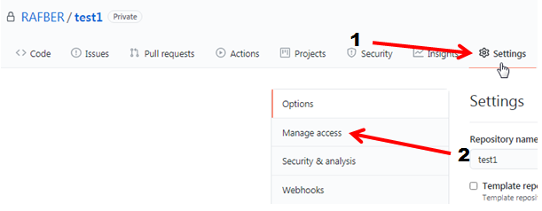

# GitHub pages
{: .no_toc}

## Table of contents
{: .no_toc}

1. TOC
{:toc}

# Creating the public *GitHub Pages* repository

*GitHub Pages* is designed to host your personal, organization, or project pages from a GitHub repository.

There are two ways to create the public repository *GitHub pages*:  
* Create a new repository as "Public" from the beginning and
* Change the "Private" repository to "Public" repository

Creating a new repository procedure are described in *GitHub - tha basics* in the chapter *Creating a new repository*. If you created the new repository as "Private" you need to change it as "Public" and enable the *GitHub pages* functionality to this repository.

To do this proceed as follows:

* Choose the private repository you want to make public as a *GitHub pages* and click the **Settings** button (1) and **Manage access** (2) later on.

   

   **Note:** Confirm your password if prompted. 

* The following dialog should appear:

   

*  Click the **Manage** link. You will be redirected to the *Danger zone* section. Click the **Change visibility** button.

   

* Mark the option *Make public* (1), type the indicated text into the comment field (2) and click the  
**I understand, change repository visibility** button.

   

# Publication the web sites from the *GitHub Pages* repository

If you have the "Public" repository with the content then you need to enable the *GitHub pages* functionality on this repository. 

**Note:** Below procedure must also by performed if you create a new repository as a "Public" from the beginning.

* Choose the "Public" repository you want to enable *GitHub pages* functionality and click the **Settings** button (1) and **Options** (2) later on.

   

* Scroll to the *GitHub pages* section. From the drop-down list (1) select the *main* branch (2) and then click the **Save** button (3).

   

**Note:** This feature does not work if you have an empty repository. You have to add the content to the repository first. 

* Your site is ready to publish now. The following message should appear that your site is ready to be published

   

* Go to your repository and click the *Environments* 

   

* Click the **View deployment** button. Choose the last deployment that have been made. Refresh the page if necessary.

   

* Your site is published now!

   

* In the *GitHub pages* section (repository_name> options> scroll to Github pages section) the following message should appear:

   

# Publication the web sites from the *GitHub Pages* repository using the Jekyll generator and Just the Docs template

## Jekyll 
Jekyll is the GitHub-integrated Static Site Generator, which allows you to generate web sites using ready-made templates such as Just the Docs.

Learn more about Jekyll

[Jekyll](https://jekyllrb.com/)

## Just the Docs

Just the Docs is a template that tells Jekyll how the site should be generated.  
In order for a site to be generated by Jekyll using the Just the Docs template, you have to copy the Just the Docs template into your account on the GitHub server.

Learn more about Just the Docs

[Just the Docs](https://pmarsceill.github.io/just-the-docs/)

## Forking the just-the-docs repository

To copy Just the Docs into yor account on the GitHub server go to [Just the Docs](https://github.com/pmarsceill/just-the-docs) and proceed as follows:

* Click the **Fork** button. 

   

**Note:** The *Fork* function make a files copy on your account without any connection with the source files. You can modify copied files without any effect for the files in primary source.

* The just-the-docs repository is now on your account on the GitHub server. You need to clone it into your PC using the GitHub Desktop. 
To clone the just-the-docs repository into your PC proceed as follows:

* Click the **Code** button (1) and choose the *Open with GitHub Desktop* option (2).
  
   

* The following dialog should appear:

  

  Click the URL tab. Choose the location for your created repository and click the **Clone** button.

* Your new repository should appear in *Current repository* tab in the GitHub Desktop and new folder should be created in the indicated location.

  

  

## Files structure

**Important:** In order for a page to be generated by Jekyll using the Just the Docs template, files must be placed in a repository according to a schema defined by just-the-docs.

In order for the site to be generated properly, the files structure must look as follows: 

   
   *Fig.1-2: Basic configuration of the files structure in the repository to publish the web sites using just-the-docs template*

### Configuration file

* The _config.yml file is a configuration file for the Jekyll generator. The _config.yml file should look like this:  
**Note:** Explanations for each command are given in parentheses.

   

### Markdown files - the main rules

**Note:** Each Markdown file (.md) must start with Jekyll code to be displayed using the just-the-docs template.

* index.md file in the root level

   

* Markdown files in docs folder

   

* index.md file in folder of the chapter 

   

* Markdown files in the folder of chapter (parent folder)

   

### Pictures

* Place in the pictures always in the assets / images folder.
* If the files structure is multi-level, the assets / images folder must always be on the "Parent" folder level to render the pictures correctly also in "Children" files.

## Publication

After adding the files to the repository according to the just-the-docs template, you can publish your website.  
The procedure for publishing pages according to the just-the-docs template is the same as for publishing pages without using the just-the-docs template and is described above in chapter *Publication the web sites from the GitHub Pages repository*.

# Helpful links

**Important:** 
* Make the changes only on your own copy of just-the-docs repository!  
* Make a fork the just-the-docs repository first!

* [Source files configuration](https://pmarsceill.github.io/just-the-docs/docs/configuration/)
* [Navigation structure](https://pmarsceill.github.io/just-the-docs/docs/navigation-structure/)
* [Template customization](https://pmarsceill.github.io/just-the-docs/docs/customization/)

