# Working with branches
{: .no_toc}

## Table of contents
{: .no_toc}

1. TOC
{:toc}

The general idea of work with branches in GitHub is that the developer makes some changes does not make changes to the main branch but into his branch. Then the changes are committed and merged into the main branch.  
The developer works without ane affect to main code base.  
The great advantage of such work is that the main code base is error-free because changes to the main code base are merged only after approval by the editor.  
Use a branch always if you would like to isolate your work without affecting to other branches in the repository.

## Basic work flow of GitHub branch

   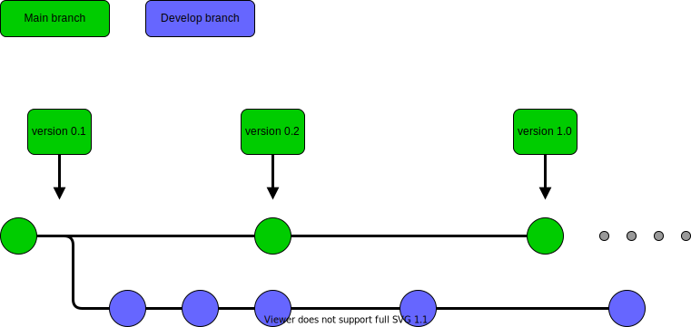

# How it works?

## Review process

* Choose your repository you want to make a branch and click the **Settings** button.

   **Note:** The repository you work on must be "Public".

   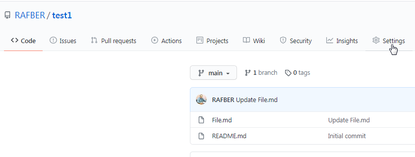

* Choose the *Branches* from the settings menu.

   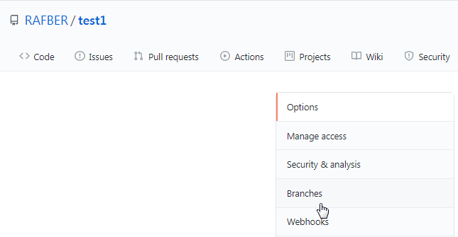

* Go to section *Branch protection rules* and click the **Add rule** button.

   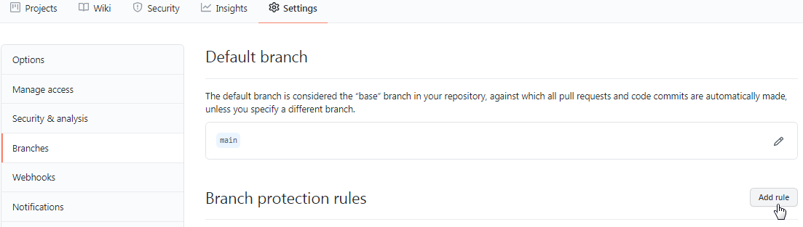

* Type the branch name (1) (should be the same as default branch) and mark the option *Require pull request reviews before merging*. That is means that any changes in your branch need your approval. Click the **Create** button.

   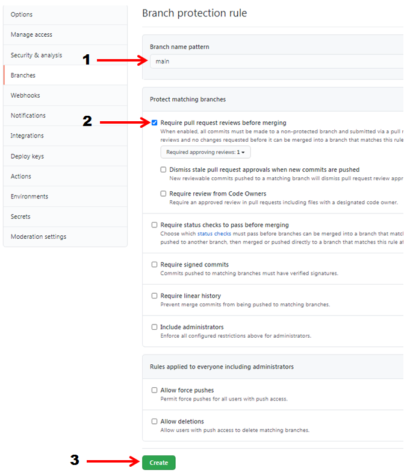

* Click the **Save changes** button.

   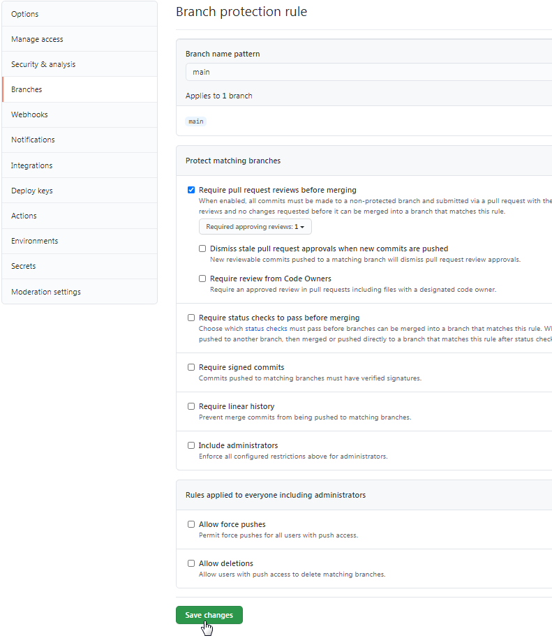

* Go to the *Manage access* option in menu and invite a collaborator to work on your repository. The procedure invitation of collaborator is described in *GitHub - the basics*, chapter *Making the repository available to other users*
* In the next step the collaborator needs to clone repository from your GitHub account. The repository clone procedure is described in *GitHub - the basics*, chapter *Creating a new repository on the GitHub server*

* After the repository clone the collaborator needs to create a new branch in his PC using the GitHub Desktop. 

* In the proper repository (1) in the *Branch* tab he needs to choose the *New branch* option.

   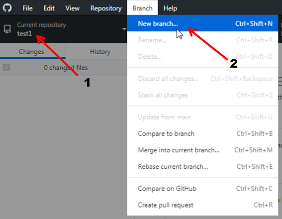

* He should name the new branch (1) and click the **Create branch** button.

   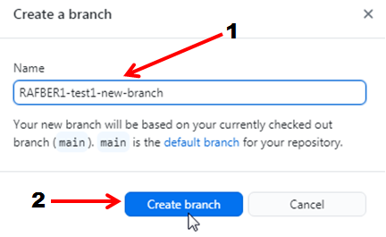

   The new branch exist now only in collaborator PC. He should Publish branch into repository by click thr **Publish branch** button.

   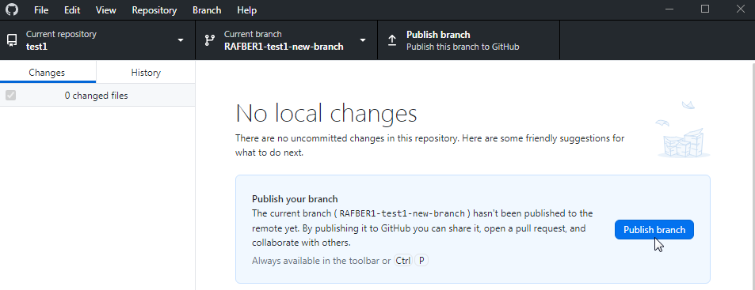

* Now exist two branches in repository.

   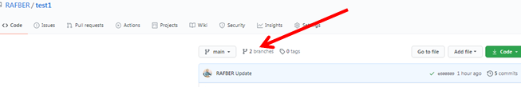

* By click on it the details of the creating branch are visible.

   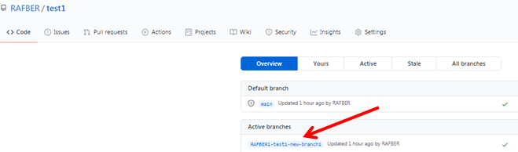

* After the changes implemented in file he work on he should make a commit and Push origin AND THEN MAKE A *Pull request* by click the **Create pull request** button.

   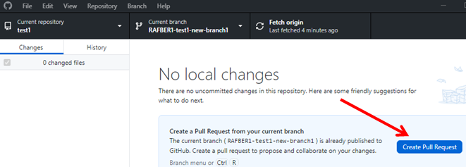

* In the next step he need to type a comment (1), choose a reviewer (2) and click the **Create pull request** button.

   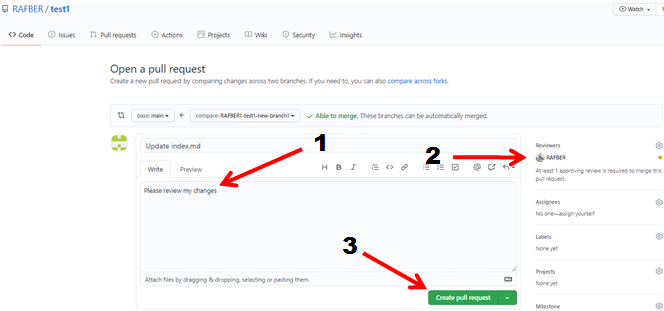

* The following window should appear:

   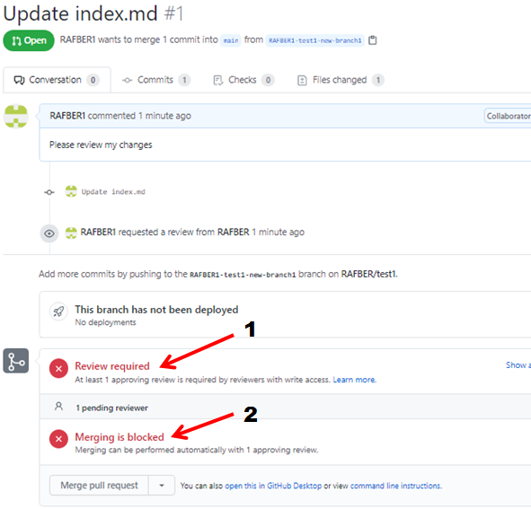

   Review is required (1) because you have marked this option during adding the rules to the branch and merging is blocked (2) till you accept the changes.

* The *Pull request* is visible now into your account. Click on it.

   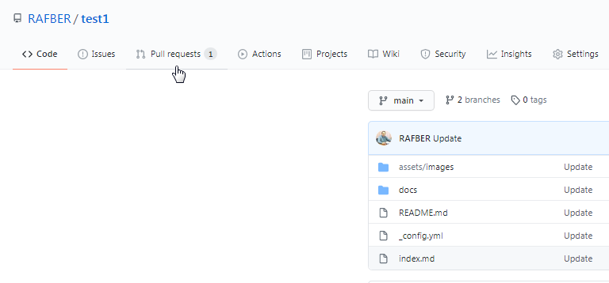

*   You have also received the message by email informing you about the changes.

    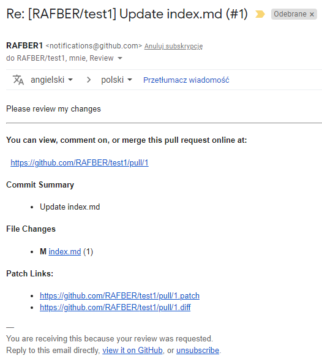

* Click on the file that has been changed.

   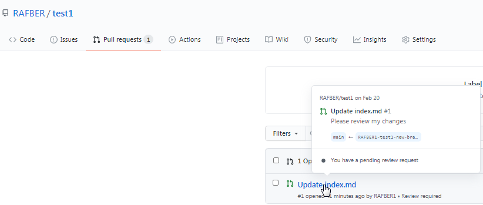

* You have information about *Commits* (1) and files changed (2). Click the **Add your review** (3) button.

   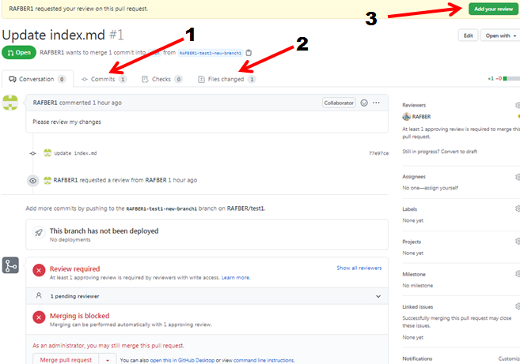

* You can check the changes (1) now. Click the **Review changes** (2) button, mark the *Approve* option (3) and click the **Submit review** (4) button.

   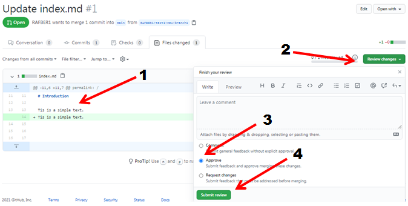

* The merging is possible now. Add the comment in comments field if you want and click the **Merge pull request** button.

   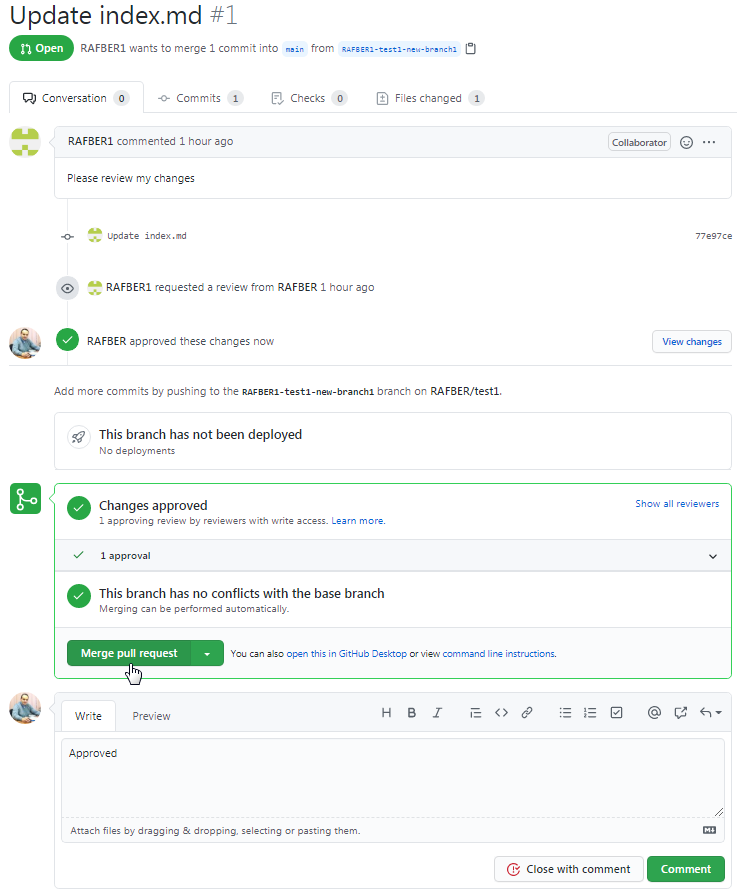

* Confirm merge.

   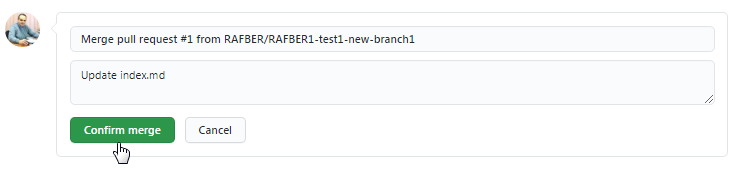

* You can delete the branch if you don't need it anymore. 
  
   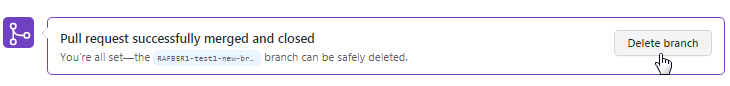

* Your collaborator should delete this branch in his GitHub Desktop.

   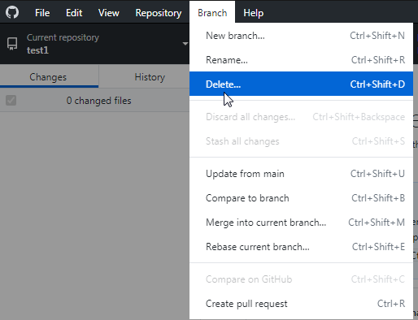

Learn more about GitHub branches

[GitHub branches](https://docs.github.com/en/github/collaborating-with-issues-and-pull-requests/about-branches)
