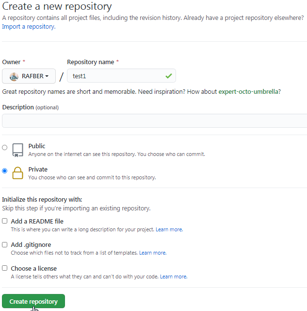

# How to work with GitHub
{: .no_toc}

## Table of contents
{: .no_toc}

1. TOC
{:toc}

# What is GitHub?
* GitHub is a code hosting platform for version control and collaboration. It lets you and others work together on projects from anywhere.

* It was created by Linus Torvalds.  
* The files "live" locally on our computer, and their copy on
the GitHub server, from where we can share them with other GitHub users.
* If we work in a group, everyone can have their own files version called
**branch**, which it can then incorporate into a shared version (operation
joining is called **merge**). Branches are also useful for solo work, when we're working on a draft version and then we include it in the official version.

## What is the Git, GitHub and GitHub Desktop?
Git is a distributed version control system. This is a tool, conception.  
GitHub is a cloud-based hosting service that lets you manage Git repositories.  
GitHub Desktop is a special application to menage the content on the GitHub server from local PC.

To work with GitHub you need to create an account on it.

# How to create an account on GitHub?

* Go to [github.com](https://github.com/) and click *Sign up for GitHub*.  

  

* Enter your *Username*, *Email address* and *Password*. Verify that "you are not a robot" and click **Create account** button. You can change the user name and password later on.

  

* In the next step mark your preferences and the correct topics what you're interested in and click **Complete setup**. You will be asked to verify your email address. 

  

* Go to your mailbox and click on the link sent by GitHub. Your account is ready to work now. In next step or later on you can complete your profile if you want, add the profile picture, etc.

* Helpful links: 

  [GitHub guides](https://guides.github.com/activities/hello-world/)

  [GitHub Help](https://docs.github.com/en)

  [Video tutorials](https://www.youtube.com/githubguides)

# GitHub Desktop

To work with GitHub hosting service you should install also the GitHub Desktop on your PC.  
To installation instructions of the GitHub Desktop go to:  
[GitHub Desktop installation](GitHub-Desktop.md)

# Working with GitHub

## Creating a new repository

It can create a new repository in two ways:  
Locally in the Github Desktop application and directly on the GitHub server.

### Creating a new repository in GitHub Desktop

* File tab> New repository.

  

* The following dialog should appear:

  

  Enter the repository name, description and indicate the path in your PC. The path should be as short as possible. Mark the field *Initialize this repository with a README* (a README file will be created) and click **Create repository**. The *Git ignore* and *License* fields should be marked as "None".

* The new repository has been created in your PC. You need to publish your repository on the GitHub server. Click the **Publish repository** button.

  

* The following dialog should appear:

  

  Choose the GitHub.com tab. Mark the field *Keep this code private* if the repository should be available only for you. You can change this option later to give the access to your repository for other GitHub users. Click the **Publish repository** button.

* Check the GitHub server. The new repository should appear in your GitHub account. Refresh the page if is not visible.

  

### Creating a new repository on the GitHub server.

You can create a new repository directly on the GitHub server as well. To create it proceed as follows:

* Click the **New** button on the main screen in your GitHub account.

  

* Enter the repository name. Decide that the repository should be *Private* or *Public*, mark the *Add a README file* field and click the **Create repository** button.

  

* The new repository has been created. The following screen should appear:

  

  At this moment your repository exist only on the GitHub server. You need to clone it into your PC. 

* Click the **Code** button (1) and choose the *Open with GitHub Desktop* option (2).

  

* The following dialog should appear:

  

  Click the URL tab. Choose the location for your created repository and click the **Clone** button.

* Your new repository should appear in *Current repository* tab in the GitHub Desktop and new folder should be created in the indicated location.

  

  

  You can also create a new repositories from other place in your account on the GitHub server.

* In your profile main screen click the *Repositories* (1) and the **New** button (2) later on.

  

* You can also create a new repository by click the **Start a project** button on main GitHub screen (you must be logged in).

  

  In either case, the procedure for creating a new repository is the same.

# Adding the files into the GitHub repository

To add the files into the GitHub repository proceed as follows:
* Create a new file in Visual Studio Code.

   

* Save this file as a Markdown file (file_name.md) in proper repository on your PC. 

   

* Go to the GitHub Desktop and from drop-down list in the section *Current repository* choose the proper repository where you have saved the file.

   

* Your file is visible now in GitHub Desktop with changes you have made. Add the description in the *Comment field* (1) (mandatory) and click the **Commit to main** (2) button.

  

* Click the **Push origin** button to send the file to the GitHub server.

  

* Go to the your GitHub server account and refresh the page. The file should appear in your repository on the GitHub server.

  

## Working with files, commits 

Important rules to work with GitHub:
* Make a *Commit* after any meaningful changes in your file
* Send the changes to the GitHub server using the *Push origin* a few times a day

You can always return to commits to see the changes.

## Working in group

If you work in group is necessary to pull the changes into your local repository if you want to work on it.

To pull the changes on your local PC proceed as follows:

* In current repository that you work on click the *Fetch origin*

  

* If someone made a changes in your file the **Pull origin** button should be "active". Click on the **Pull origin** button. Your file will be updated.

  

* If you work in group make a *Pull origin* always before start your work

# Making the repository available to other users

If you created a new repository as a "Private" you can invite selected users to share it.  
To invite selected users to your private repository proceed as follows:

* Choose the private repository you want to share.

   

* Click the **Settings** (1) and **Manage access** (2) later on. 

   

* The following window should appear:

   

* Click **Invite a collaborator**. In the dialog box, search for and enter the name of the user you want to invite and click **Invite a collaborator**.

   

* In the next step click **Add the *selected user* to this repository**.

   

* The following dialog should appear:

   

* Your invitation is waiting now for the invited user acceptance.  
GitHub automatically sent the message to email address provided on the GitHub server. The invited user has to accept them by clicking "accept" in the message he has received.  

   

* After acceptance by invited user the *Direct access* should be change from "0 collaborators"

   

   To "1 collaborator" (or more if you invite more than one user). 

   

   Refresh the page if you don't see the invited user after his acceptance.

# Create a public *GitHub Pages* repository

*GitHub Pages* is designed to host your personal, organization, or project pages from a GitHub repository.

There are two ways to create the public repository *GitHub pages*:  
* Create a new repository as a "Public" from the beginning and
* Change the "Private" repository to "Public" repository

Creating a new repository procedure are described above in the chapter ***Creating a new repository***. If you created the new repository as a "Private" you need to change it as a "Public" and enable the *GitHub pages* to this repository.

To do this proceed as follows:

* Choose the private repository you want to make public as a *GitHub pages* and click the **Settings** (1) button and **Manage access** (2) later on.

   

   **Note:** Confirm your password if prompted. 

* The following dialog should appear:

   

*  Click the **Manage** link. You will be redirected to the *Danger zone* field. Click the **Change visibility** button.

   

* Mark the option *Make public* (1), type the indicated text into the comment field (2) and Click the **I understand, change repository visibility** button.

   

# Publishing the web sites from the *GitHub Pages* repository

If you have the "Public" repository with the content then you need to enable the *GitHub pages* functionality on this repository. 

**Note:** Below procedure must also by performed if you create a new repository as a "Public" from the beginning.

* Choose the "Public" repository you want to enable *GitHub pages* functionality and click the **Settings** (1) button and **Options** (2) later on.

   

* Scroll to the *GitHub pages* section. From the drop-down list (1) select the *main* branch (2) and then click the **Save** (3) button.

   

**Note:** This feature does not work if you have an empty repository. You have to add the content to the repository first. 

* Your site is ready to publish now. The following message should appear that your site is ready to be published

   

* Go to your repository and click the *Environments* 

   

* Click the **View deployment** button. Choose the last deployment that have been made. Refresh the page if necessary.

   

* Your site is published now!

   

* In the *GitHub pages* section (repository_name> options> scroll to Github pages section) the following message should appear:

   

# Publishing the web sites from the *GitHub Pages* repository using the Jekyll and Just the Docs template

## Jekyll 
Jekyll is the GitHub-integrated Static Site Generator, which allows you to generate web pages using ready-made templates such as Just the Docs.

Learn more

[Jekyll](Jekyll.md)

## Just the Docs

Just the Docs is a template that tells Jekyll how the page should be generated.  
In order for a page to be generated by Jekyll using the Just the Docs template, you have to copy the Just the Docs template into your account an the GitHub server.

## Forking the just-the-docs repository

To copy Just the Docs into yor account on the GitHub server go to [Just the Docs](https://github.com/pmarsceill/just-the-docs) and proceed as follows:

* Click the **Fork** button. 

   

**Note:** The *Fork* function make a files copy on your account without any connection with the source files. You can modify copied files without any changes done in primary source.

* The just-the-docs repository is now on your account on the GitHub server. You need to clone it into your PC using the GitHub Desktop. 
To clone the just-the-docs repository into your PC proceed as follows:

* Click the **Code** (1) button and choose the *Open with GitHub Desktop* (2) option.
  
   

* The following dialog should appear:

  

  Click the URL tab. Choose the location for your created repository and click the **Clone** button.

* Your new repository should appear in *Current repository* tab in the GitHub Desktop and new folder should be created in the indicated location.

  

  

Learn more about Just the Docs template

[Just the Docs](just-the-docs.md)

## Files structure

**Important:** In order for a page to be generated by Jekyll using the Just the Docs template, files must be placed in a repository according to a schema defined by just-the-docs.

In order for the page to be generated properly, the file structure must look as follows: 

   

Każdy plik musi zaczynac sie od kodu Jekylla, aby mógł zostac wyświetlony uzywając szablonu just-the-docs.

Zdjęcia musza zawsze znajdowac siww w folderze assets/images.
Jeżeli structura plików jest wielopoziomowa to Aby zdjęcia były renderowane również w plikach "children" to folder assets/images musi być zawsze na poziomie folderu "Parent".

# Working with **Branches**