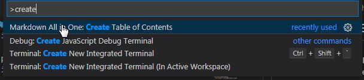
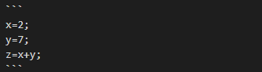

# Markdown-the basics
{: .no_toc}


## Table of contents
{: .no_toc}

1. TOC
{:toc}


# Introduction
## What is Markdown?  
Markdown is a simple text format. This is the so-called “quick documentation” standard in IT branch and related fields. It is mainly used to generate HTML files. With Markdown is possible to create the web pages without any additional tools. 

## Advantages
* Very simple format, readable also without processing
* Documentation can be expanded to any size also by attach another files
* Easily manage large numbers of documents and reuse
* Free tools to write in Markdown with preview
* Other input and output formats can be generated because Markdown is a simple text file that does not impose anything
* The contents can be downloaded and modified in any way
* Appearance separated from the content by preview window

## Disadvantages
* Markdown is a simple to simple things but more difficult to more complicated (e.g. tables, formulas)
* Markdown is a text format – during the transfer between different tools/technologies needs to be aware of the line break and character encoding

# Functionality

## Main function of the text format 

### Tittle

<!-- Example for title -->
Text displayed ofter the rendering  

Title
=====

Markdown entry text:
<!-- Example for title -->
    Title  
    =====

**Note:** The "Tittle" should be one in current document otherwise the document structure will be wrong. 

### Paragraph

<!--Example of paragraph of text-->
    This is a paragraph of text.

    This is another paragraph of text.

    This is a line.  
    This is another line.  
    This is not a new line.  

<!--Example of another paragraph of text-->
    Paragraph of text that spans over he line. See how this displays when I write and write and write. What happens when I press enter? Nothing!  
    If I want a new line, I put two spaces and them Enter. This is still the same paragraph.

### Bold, Italic, Quote

<!--Example for bold text-->
* See how to insert **bold** text!

<!--Example for bold text-->
     See how to insert **bold** text!

<!--Example for Italic-->
* And that's *How italic is defined*.

<!--Example for Italic-->
    And that's *How italic is defined*.

<!--Example for quote-->
* Example for Quote

  A wise man once said:
  >Don't listen to me!  
  >Why would you?

  And he was right.

<!--Example for quote-->
      A wise man once said:
      >Don't listen to me!  
      >Why would you?

      And he was right.

## Creating a document structure 

### Headers

<!--Example for Headers-->
# Header of chapter 1
{: .no_toc}  
This is a paragraph of text.This is a paragraph of text.This is a paragraph of text.This is a paragraph of text.This is a paragraph of text.
# Header of chapter 2
{: .no_toc}  
This is a paragraph of text.This is a paragraph of text.This is a paragraph of text.This is a paragraph of text.This is a paragraph of text.

## Chapter 2.1
{: .no_toc}  
Chapter text.
## Chapter 2.2
{: .no_toc}  
More chapter text.

Or (second option)

# 1. Header of chapters
{: .no_toc}  
This is a paragraph of text.This is a paragraph of text.This is a paragraph of text.This is a paragraph of text.This is a paragraph of text.
# 2. Header of chapter
{: .no_toc}  
This is a paragraph of text.This is a paragraph of text.This is a paragraph of text.This is a paragraph of text.This is a paragraph of text.
## 2.1 Chapter
{: .no_toc}  
Chapter text.
## 2.2 Chapter
{: .no_toc}  
More chapter text.
### 2.2.1 Chapter
{: .no_toc}  
More chapter text.

<!--Example for Headers-->
    # Header of chapter 1
    This is a paragraph of text.This is a paragraph of text.This is a paragraph of text.This is a paragraph of text.This is a paragraph of text.
    # Header of chapter 2
    This is a paragraph of text.This is a paragraph of text.This is a paragraph of text.This is a paragraph of text.This is a paragraph of text.

    ## Chapter 2.1
    Chapter text.
    ## Chapter 2.2
    More chapter text.

    Or (second option)

    # 1. Header of chapters
    This is a paragraph of text.This is a paragraph of text.This is a paragraph of text.This is a paragraph of text.This is a paragraph of text.
    # 2. Header of chapter
    This is a paragraph of text.This is a paragraph of text.This is a paragraph of text.This is a paragraph of text.This is a paragraph of text.
    ## 2.1 Chapter
    Chapter text.
    ## 2.2 Chapter
    More chapter text.
    ### 2.2.1 Chapter
    More chapter text.- [Sample document](#sample-document)

### Table of contents

To create the *Table of contents* proceed as follows:  
* Click the mouse cursor in the proper place of the document where you would like to implement the *Table of contents*
* Use the keyboard shortcut Ctrl+Shift+P
* Enter the "create" in command field and choose the option: *Markdown All in One: Create Table of Contents*  
  **Note:** The Markdown All in One extension must be previously installed. 

   

For the extension installation procedure please refer to the document *Visual Studio Code - useful options*  
[Visual Studio Code – useful options](Visual_Studio_Code–useful_options.md)

<!--Example for Bullet list-->
### Bullet list
* bullet
* another bullet
* more bullets

<!--Example for Bullet list-->
     * bullet
     * another bullet
     * more bullets

<!--Example for Numbered list-->
### Numbered list
1. First point
2. Second point
3. Third point

<!--Example for Numbered list-->
    1. First point
    2. Second point
    3. Third point


<!--Example text with equation-->
### Equation
If x=2 then it's a relatively small x.

<!--Example text with equation-->
    If x=2 then it's a relatively small x.

<!--Example for in line code-->
### In line code
If you specify `x=2;` then your program will substitute 2 for x.

<!--Example for in line code-->
    If you specify `x=2;` then your program will substitute 2 for x.

<!--A block of code-->
### Block of code

Here comes a code block:
```
x=2;
y=7;
z=x+y;
```



<!--Example for Table-->
### Table

| header      | another header      |
| ----------- | ------------------- |
| row content | another row content |
| row content | another row content |
| row content | another row content |

<!--Example for Table-->
    | header      | another header      |
    | ----------- | ------------------- |
    | row content | another row content |
    | row content | another row content |
    | row content | another row content |

Paragraph after table

## Images  

<!--Example for Images-->


<!--Example for Images-->
    

## Links to other source  

<!--Example for links-->
[Weather](http://meteo.pl)

    [Weather](http://meteo.pl)

[Validation](https://validator.w3.org/nu/#textare)

    [Validation](https://validator.w3.org/nu/#textare)

Example for linking to another file.  
**Note:** Both files must be in the same folder.  

    [Reference](Test.md)

## Variables

## Variables
{: .no_toc}

1. first
2. second
3. third

<!--Example for links-->
    # Variables
    1. first
    2. second
    3. third

## Helpful links

[Markdown cheat-sheet](./PDF/markdown-cheatsheet.pdf)

[Markdown specifications](https://daringfireball.net/projects/markdown/)

[Markdown tutorial](https://commonmark.org/help/tutorial/index.html)

[Dialects of Markdown](https://sodocumentation.net/markdown/topic/1865/dialects-flavours)

[Visual Studio Code extensions for Markdown](https://github.com/mundimark/awesome-markdown)

[Visual Studio Code – useful options](Visual_Studio_Code–useful_options.md)

To install Visual Studio Code go to:  

[VS Code installation instructions](Installation_instruction_for_Visual_Studio_Code_software.md)

