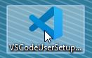

# Installation instructions for Visual Studio Code editor #

**Note**: These installation instructions are for Windows 7 64bit.

To install Visual Studio Code go to page https://code.visualstudio.com/, download the setup file and proceed as follows:

1. Double-click the **VSCodeUser** setup file.  

   

2. Click the **Launch** button.  

   

3. Select the proper language version and click **Ok**.

   ..

   

4. On the next warning info click **Ok**.

   

5. Read and accept the agreement and click **Next**.

   

6. Choose the location of the installation and click **Next**.

   

7. Select Start Menu folder and click **Next**.
   
   

8. Mark *Create desktop icon* if you would like the shortcut on your desktop and mark  
   the additional installation tasks and click **Next**.

    

9. The VS Code is ready to install now. Click the **Install** button.

    
    
10. After installation is completed mark the *Launch Visual Studio Code* and click the **Finish** button.

     

11. The main screen should appear. The Visual Studio Code is ready to work now.

     

# Enjoy your work! #

For more details about VS Code go to page:  
[VS Code - Installation, Overview, User guide](https://code.visualstudio.com/)

